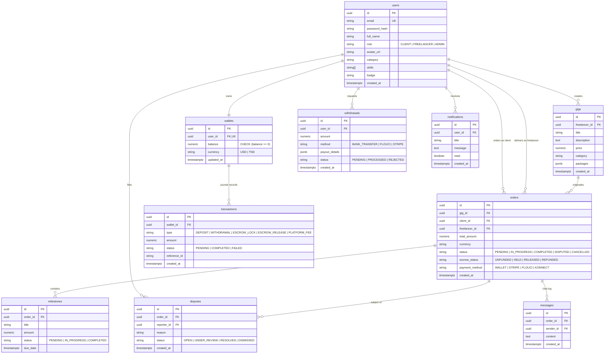

# PROJECT ARCHITECTURE MAP & SYSTEM BLUEPRINT
**Document Version**: 1.0.0  
**Target System**: Asteria Freelance Platform  
**Architecture Style**: Next.js 14 App Router, Server Actions, Hybrid PostgreSQL / In-Memory State  

---

## 1. HIGH-LEVEL ARCHITECTURAL OVERVIEW

The Asteria Freelance platform is architected around the Next.js 14 App Router paradigm. It combines React Server Components (RSC) for layout and static rendering with interactive Client Components for real-time order tracking, chat, and wallet operations.

The backend infrastructure utilizes Next.js API Route Handlers (`app/api/`) and Server Actions (`app/actions/`) running on Node.js/Vercel serverless functions, interfacing with a hybrid persistence layer (Supabase PostgreSQL with an in-memory fallback store), external payment gateways (Stripe, Flouci, Konnect), and generative AI models (Google Gemini).

```
+----------------------------------------------------------------------------------------------------+
|                                      CLIENT BROWSER (React 18)                                     |
|  +--------------------+  +----------------------+  +---------------------+  +--------------------+ |
|  | Public Market      |  | Client Dashboard     |  | Freelancer Portal   |  | Admin Governance   | |
|  | (Gigs, Search, AI) |  | (Orders, Escrow)     |  | (Proposals, Payout) |  | (Users, Disputes)  | |
|  +--------------------+  +----------------------+  +---------------------+  +--------------------+ |
+----------------------------------------------------------------------------------------------------+
                                                  |
                                                  | HTTPS / Server Actions / REST
                                                  v
+----------------------------------------------------------------------------------------------------+
|                                   NEXT.JS 14 APP ROUTER BACKEND                                    |
|                                                                                                    |
|  [ Edge Middleware ] ---> Session extraction, role routing, pathname rewrite                      |
|                                                                                                    |
|  [ Server Actions ]                                                                                |
|    - app/actions/auth.ts (Register, Login, Demo actions)                                           |
|                                                                                                    |
|  [ API Route Handlers ]                                                                            |
|    - /api/auth/*          - /api/orders/*         - /api/wallet/*         - /api/admin/*           |
|    - /api/stripe/*        - /api/payments/*       - /api/kyc/*            - /api/ai/generate       |
|                                                                                                    |
|  [ Core Business Logic Engine ]                                                                    |
|    - lib/ledger.ts        - lib/ledgerCore.ts     - lib/fx.ts             - lib/idempotency.ts     |
|    - lib/auth.ts          - lib/authz.ts          - lib/email.ts          - lib/utils.ts           |
+----------------------------------------------------------------------------------------------------+
                                      |                            |
                     +----------------+                            +-------------------+
                     |                                                                 |
                     v                                                                 v
+--------------------------------------------+                   +-----------------------------------+
|            PERSISTENCE LAYER               |                   |       EXTERNAL INTEGRATIONS       |
|                                            |                   |                                   |
|  [ Primary: Supabase PostgreSQL ]          |                   |  [ Stripe API & Webhooks ]        |
|    - Relational tables                     |                   |    - Credit card checkout         |
|    - Stored RPCs (credit/debit wallet)     |                   |                                   |
|    - Row Level Security (RLS)              |                   |  [ Flouci & Konnect Gateways ]    |
|                                            |                   |    - Tunisian Dinar (TND) payouts |
|  [ Fallback / Ghost State: In-Memory Map ] |                   |                                   |
|    - store.users, store.gigs, store.orders |                   |  [ Google Gemini 1.5 Flash ]      |
|    - store.milestones, store.reports       |                   |    - Proposal & Gig Generation    |
|    - store.withdrawals, store.messages     |                   |                                   |
|    *(Lost on serverless container recycle)*|                   |  [ Resend Email (Uninstalled) ]   |
+--------------------------------------------+                   +-----------------------------------+
```

---

## 2. DIRECTORY STRUCTURE & MODULE RESPONSIBILITIES

```
Asteria-freelance/
├── __tests__/                   # Jest unit test suites
│   └── ledger.test.ts          # Pure arithmetic tests for ledgerCore.ts
├── app/                        # Next.js 14 App Router tree
│   ├── actions/                # Next.js Server Actions
│   │   └── auth.ts             # User registration, login, and admin demo backdoor
│   ├── api/                    # HTTP REST Endpoints
│   │   ├── admin/              # Admin-only management endpoints (users, stats)
│   │   ├── ai/generate/        # Google Gemini AI text generation endpoint
│   │   ├── cron/reconciliation/# Nightly balance reconciliation job
│   │   ├── kyc/                # Identity verification uploads and webhooks
│   │   ├── notifications/      # User notification list and read status
│   │   ├── orders/             # Order creation, milestone status, and escrow release
│   │   ├── payments/           # Flouci and Konnect Tunisian payment gateways
│   │   ├── stripe/             # Stripe checkout session creation and webhook handler
│   │   └── wallet/             # Wallet balance queries, deposits, and withdrawals
│   ├── dashboard/              # Protected dashboards (Client, Freelancer, Admin)
│   ├── freelancers/            # Public freelancer browse and profile views
│   ├── gig/                    # Public gig browse and detail views
│   ├── login/ & register/      # Authentication entry pages
│   ├── layout.tsx              # Root HTML layout with Navigation & Footer
│   └── page.tsx                # Public landing page with hero, categories, and CTA
├── components/                 # React UI Components
│   ├── admin/                  # Admin statistics cards, user management tables
│   ├── ai/                     # AI Proposal / Gig generator modal components
│   ├── freelancers/            # Freelancer card grid, filter sidebar
│   ├── gigs/                   # Gig card lists, search bar, package selector
│   ├── layout/                 # Navbar, Footer, User Profile menu
│   ├── orders/                 # Order workspace, chat messenger, milestone manager
│   ├── ui/                     # Primitives (Button, Input, Modal, Badge, Card)
│   └── wallet/                 # Balance widget, deposit modal, withdrawal drawer
├── lib/                        # Core Domain & Infrastructure Libraries
│   ├── auth.ts                 # JWT session generation and cookie extraction
│   ├── authz.ts                # Role-Based Access Control guards (requireRole)
│   ├── db.ts                   # Hybrid Database interface (Supabase + In-Memory)
│   ├── email.ts                # Email notification dispatcher (depends on uninstalled resend)
│   ├── fx.ts                   # Foreign exchange engine (USD <-> TND fixed & API rates)
│   ├── idempotency.ts          # In-memory idempotency cache
│   ├── ledger.ts               # Escrow manager and Supabase wallet mutation bridge
│   ├── ledgerCore.ts           # Pure double-entry accounting math engine
│   └── utils.ts                # Tailwind class mergers (clsx, twMerge)
├── supabase/                   # Supabase Database Migrations & Seeds
│   ├── migrations/
│   │   ├── 001_initial_schema.sql
│   │   ├── 002_functions.sql
│   │   ├── 003_rls_policies.sql
│   │   ├── 004_test_seed.sql
│   │   └── 20260823083000_add_missing_columns.sql
│   └── seed.sql                # Production seed data
├── middleware.ts               # Edge routing, session guard, demo auth bypass
└── next.config.mjs             # Next.js build configuration & image domains
```

---

## 3. CORE DATA FLOW DIAGRAMS

### 3.1 Authentication & Session Token Lifecycle
```
User Enters Credentials
         |
         v
[ Client Component (app/login/page.tsx) ]
         |
         | Form Submission (Action)
         v
[ Server Action: login() (app/actions/auth.ts) ]
         |
         | 1. Query user by email (lib/db.ts)
         v
[ Check Plaintext Password: user.password === password ]  <-- CRITICAL VULNERABILITY
         |
         +--- MATCH ---> 2. Generate JWT { id, email, role }
         |               3. Set-Cookie: auth-token=<jwt>; HttpOnly; Path=/
         |               4. Redirect to /dashboard
         |
         +--- NO MATCH -> Return Error "Invalid credentials"
```

---

### 3.2 Escrow Order Lifecycle & Funding Flow
```
Client clicks "Hire / Order Gig"
         |
         v
[ POST /api/orders ] ---> Insert Order (status: 'PENDING', escrow: 'UNFUNDED')
         |
         +---> Option A: Wallet Payment
         |         |
         |         v
         |     [ Verify Client Balance >= total_amount ]
         |     [ Deduct Client Wallet: debit_wallet(client_id, amount) ]
         |     [ Update Order: status -> 'IN_PROGRESS', escrow -> 'HELD' ]
         |
         +---> Option B: Stripe Card Checkout
                   |
                   v
               [ POST /api/stripe/checkout ]  <-- (VULNERABILITY: Client sends amount)
                   |
                   v
               [ Stripe Hosted Checkout Page ]
                   |
                   v
               [ Customer pays with Card ]
                   |
                   v
               [ POST /api/stripe/webhook (checkout.session.completed) ]
                   |
                   v
               [ Update Order: status -> 'IN_PROGRESS', escrow -> 'HELD' ]
```

---

### 3.3 Escrow Release & Double-Entry Accounting Flow
```
Client Reviews Delivered Work & Clicks "Release Payment"
         |
         v
[ POST /api/orders/[id]/release ]
         |
         v
[ Verify Order Status is 'IN_PROGRESS' or 'COMPLETED' ]
         |
         | 1. Calculate Deductions (lib/ledger.ts)
         |    - total_amount = order.total_amount
         |    - platform_fee = total_amount * 0.12 (12%)
         |    - freelancer_amount = total_amount - platform_fee
         |
         | 2. Credit Freelancer Wallet
         |    - credit_wallet(order.freelancer_id, freelancer_amount)
         |    - Log Transaction: 'ESCROW_RELEASE'
         |
         | 3. Credit Platform Treasury
         |    - credit_wallet('platform', platform_fee)  <-- (BUG: 'platform' is not UUID)
         |    - Log Transaction: 'PLATFORM_FEE'
         |
         | 4. Update Order State
         |    - order.status = 'COMPLETED'
         |    - order.escrow_status = 'RELEASED'
         |
         v
Return HTTP 200 { success: true }
```

---

### 3.4 Payment Webhook Verification Flow (Stripe, Flouci, Konnect)
```
Payment Provider (Stripe / Flouci / Konnect)
         |
         | HTTP POST with Signature Header
         v
[ Webhook Endpoint (/api/stripe/webhook, /api/payments/flouci, /api/payments/konnect) ]
         |
         | Check Environment Secret
         |
         +--- Missing Secret in .env?
         |         |
         |         +---> Stripe: Rejects immediately (Secure)
         |         |
         |         +---> Flouci / Konnect: Falls back to sandbox secret string! (INSECURE)
         |
         v
[ Verify HMAC Signature ]
         |
         +--- Valid ---> Extract { userId, amount, currency }
         |               Credit User Wallet in DB
         |               Return 200 OK
         |
         +--- Invalid -> Return 401 / 400 Unauthorized
```

---

## 4. DATABASE ENTITY RELATIONSHIP DIAGRAM (ERD)



---

## 5. DUAL-ARCHITECTURE CONFLICT BREAKDOWN

The following table documents where the current code fractures between Supabase PostgreSQL and volatile In-Memory storage:

| Feature / Entity | PostgreSQL Table | In-Memory `store.*` | Operational Failure Impact |
|---|---|---|---|
| **Users / Profiles** | `users` / `"User"` | `store.users` | Accounts registered in memory vanish on cold start. |
| **Gigs / Listings** | `gigs` | `store.gigs` | Listings created on one serverless instance disappear on next refresh. |
| **Orders** | `orders` / `"Order"` | `store.orders` | Payments succeed on Stripe, but order state cannot be found by other workers. |
| **Milestones** | ❌ None | `store.milestones` | 100% in-memory. Complete milestone data loss upon server restart. |
| **Reports / Disputes** | ❌ None | `store.reports` | Client dispute reports are lost; freelancer can release escrow anyway. |
| **Withdrawals** | ❌ None | `store.withdrawals` | Withdrawal history is lost; no audit record for bank transfers. |
| **Chat Messages** | ❌ None | `store.messages` | Chat history disappears every time the container spins down. |
| **Notifications** | ❌ None | `store.notifications` | API crashes when attempting to mark notifications as read. |
| **Idempotency** | ❌ None | `lib/idempotency.ts` | In-memory `Map` fails to prevent duplicate webhook payments across instances. |
| **Treasury Account** | ❌ Missing UUID | In-memory Map | `credit_wallet('platform', ...)` fails Postgres validation `22P02`. |
