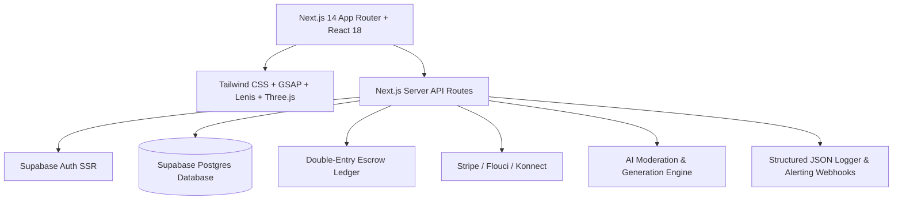
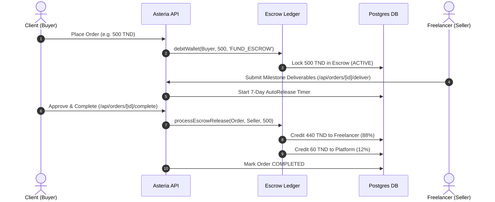
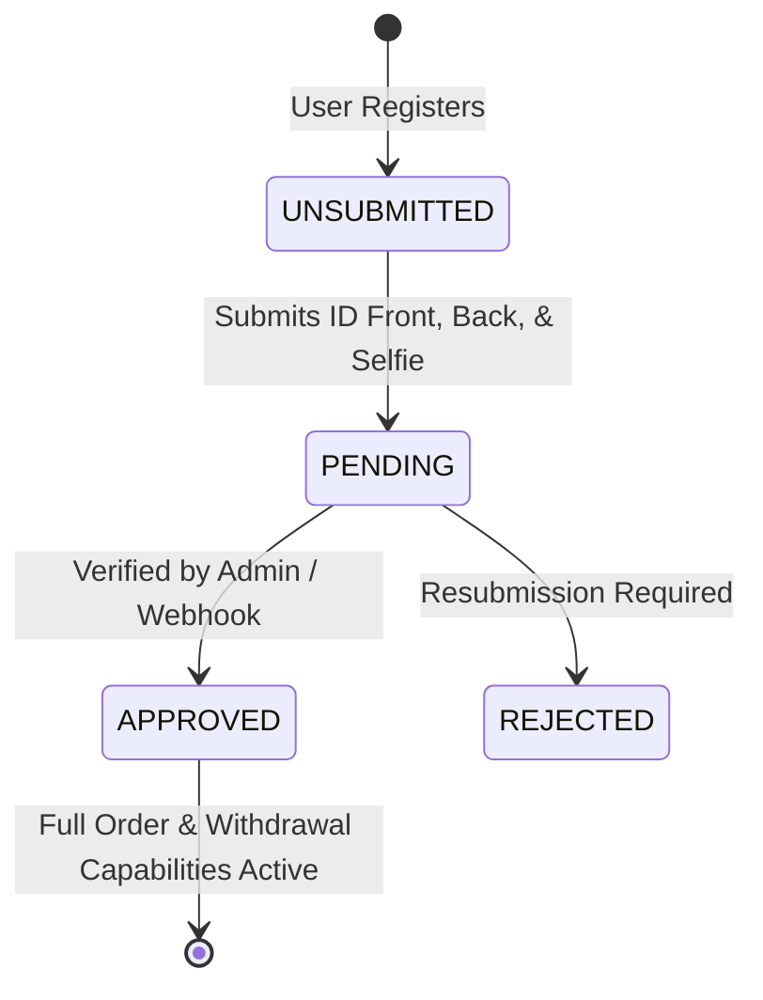

# 🌟 Asteria Freelance

[](https://nextjs.org/)
[](https://www.typescriptlang.org/)
[](https://supabase.com/)
[](https://stripe.com/)
[](https://jestjs.io/)
[](LICENSE)

> **Asteria Freelance** is a production-ready, high-performance microjob and freelance marketplace engineered for the **MENA digital economy**, featuring double-entry escrow protections, native **Tunisian Dinar (TND)** currency handling with international **USD** settlement, institutional KYC verification, private proposal security, and AI-assisted workflows.

---

## 📑 Table of Contents
- [✨ Key Features](#-key-features)
- [🏗️ System Architecture](#️-system-architecture)
- [🔄 How the Platform Works](#-how-the-platform-works)
  - [1. Escrow & Milestone Payment Lifecycle](#1-escrow--milestone-payment-lifecycle)
  - [2. KYC Identity Verification](#2-kyc-identity-verification)
  - [3. Real-Time Chat & Custom Escrow Offers](#3-real-time-chat--custom-escrow-offers)
  - [4. Private Job Proposals](#4-private-job-proposals)
  - [5. AI Writing Assistant & Safety Guardrails](#5-ai-writing-assistant--safety-guardrails)
- [🛡️ Security & Concurrency Defenses](#️-security--concurrency-defenses)
- [💻 Tech Stack](#-tech-stack)
- [📁 Project Structure](#-project-structure)
- [⚙️ Environment Variables](#️-environment-variables)
- [🚀 Quick Start & Local Setup](#-quick-start--local-setup)
- [📡 API Route Reference](#-api-route-reference)
- [🧪 Testing & Quality Assurance](#-testing--quality-assurance)

---

## ✨ Key Features

- **🔒 100% Escrow Protection**: Multi-milestone contracts where client funds are locked securely before work begins and released upon deliverable approval.
- **⏱️ 7-Day Auto-Release Guarantee**: Protects freelancers by automatically releasing escrow funds 7 days after deliverable submission if no client dispute is raised.
- **💱 Multi-Currency Engine**: Base currency in Tunisian Dinar (`TND`) with automatic Stripe currency exchange conversion (`1 TND ≈ 0.32 USD`) and MENA sandbox gateway support (Flouci, Konnect).
- **🪪 Strict Institutional KYC**: Tiered access allowing unrestricted marketplace exploration while strictly requiring approved government ID verification (CIN / Passport) before placing orders or requesting payouts.
- **💬 Real-Time Messaging & Custom Offers**: Direct buyer-seller chat with server-revalidated custom contract negotiation and 1-click escrow acceptance.
- **🙈 Private Job Proposals**: Client and Admins view all submitted bids, while freelancers are strictly restricted to seeing only their own proposal.
- **🤖 Native AI Writing Assistant**: Integrated drafting for gigs, job descriptions, and proposals with daily rate caps (20 calls/day), safety moderation filters, and AI disclosure tags.
- **📊 Admin Control Center & Automated Reconciliation**: Live user moderation, dispute arbitration dossiers, payout authorization, and automated cron reconciliation auditing with incident paging.
- **🎨 Fluid UI & Smooth Scrolling**: Powered by GSAP ScrollTrigger and Lenis smooth scrolling with an interactive Three.js 3D canvas hero and dynamic notification engine.

---

## 🏗️ System Architecture



---

## 🔄 How the Platform Works

### 1. Escrow & Milestone Payment Lifecycle

All transactions use an append-only double-entry financial ledger (`lib/ledger.ts`) with mathematical precision:
$$\text{Platform Commission} = \text{round}(\text{Order Total} \times 0.12, 2)$$
$$\text{Net Freelancer Payout} = \text{round}(\text{Order Total} - \text{Platform Commission}, 2)$$



### 2. KYC Identity Verification

- **Exploration**: Unverified users can freely browse gigs, explore job listings, and view freelancer portfolios.
- **Financial Commitment Gate**: Order placement and withdrawal payouts are locked until identity documents are reviewed and approved.



### 3. Real-Time Chat & Custom Escrow Offers

1. Freelancers and clients discuss project requirements in `/dashboard/messages`.
2. Freelancers build and send a **Custom Escrow Offer** specifying title, scope, milestones, and price.
3. The client clicks **Accept & Fund**. The server re-validates the offer against stored database records to prevent client payload tampering and funds the escrow workspace immediately.

### 4. Private Job Proposals

Clients post open job listings at `/post-job`. Competing freelancers submit custom bids and cover letters.
- **Job Owner & Admin**: Review all candidate proposals and portfolios.
- **Freelancers**: Can only view their own submitted proposal.

### 5. AI Writing Assistant & Safety Guardrails

- Accessible via `/api/ai/generate` for gig descriptions, project briefs, and proposals.
- **Rate Limit**: 20 AI generations per user per day.
- **Proactive Filter**: Automatically detects and blocks off-platform payment solicitations (e.g. WhatsApp, direct bank wires) or prohibited content.

---

## 🛡️ Security & Concurrency Defenses

| Protection | Implementation | Defense Capability |
| :--- | :--- | :--- |
| **Race Condition Defense** | PostgreSQL `SELECT ... FOR UPDATE` row locks + Node.js mutex (`withUserLock`) | Prevents concurrent parallel withdrawal requests from double-spending or draining wallet balances. |
| **Content Security Policy** | Strict CSP header in `next.config.mjs` | Restricts script, style, frame, and connect origins to block stored XSS across chat and user content. |
| **Credential Stuffing Defense** | IP-based sliding window rate limiter (`rateLimitByIp`) | Caps requests to 20/min per IP address across all authentication endpoints. |
| **Progressive Brute-Force Defense** | Account failure tracker (`checkAccountLockout`) | Triggers progressive CAPTCHA challenge after 3 failed attempts; temporary 15-min lockout at 5 failures. |
| **Scheduled Reconciliation** | `/api/cron/reconciliation` with `CRON_SECRET` | Automatically audits active escrow locks against user wallet balances and platform reserves with incident alert dispatch. |

---

## 💻 Tech Stack

- **Framework**: [Next.js 14](https://nextjs.org/) (App Router, Server Actions, API Routes)
- **Language**: [TypeScript](https://www.typescriptlang.org/) (Strict mode)
- **Database & Auth**: [Supabase](https://supabase.com/) (`@supabase/ssr`, Postgres, Row Level Security)
- **Styling**: [Tailwind CSS](https://tailwindcss.com/), [Framer Motion](https://www.framer.com/motion/)
- **Animations & 3D**: [GSAP](https://greensock.com/gsap/) (ScrollTrigger), [Lenis](https://lenis.darkroom.engineering/) (Smooth Scroll), [Three.js](https://threejs.org/)
- **Payments**: [Stripe](https://stripe.com/), Flouci Sandbox, Konnect Sandbox
- **Testing**: [Jest](https://jestjs.io/), `@testing-library/react`, ts-jest

---

## 📁 Project Structure

```text
asteria-freelance/
├── app/                        # Next.js 14 App Router
│   ├── api/                    # Serverless API routes
│   │   ├── admin/              # User moderation, logs, reconciliation, withdrawals
│   │   ├── ai/                 # AI assistant generation & safety filtering
│   │   ├── auth/               # Login, register, session endpoints
│   │   ├── cron/               # Automated scheduled reconciliation cron
│   │   ├── gigs/               # Marketplace service gigs CRUD
│   │   ├── jobs/               # Job postings & private proposals
│   │   ├── kyc/                # KYC submission & webhook receiver
│   │   ├── messages/           # Direct chat & custom escrow offer acceptance
│   │   ├── notifications/      # Live dynamic notifications engine
│   │   ├── orders/             # Escrow orders, deliverables & milestone releases
│   │   ├── stripe/             # Stripe checkout & webhook reconciliation
│   │   └── wallet/             # Payout withdrawals & ledger history
│   ├── dashboard/              # Authenticated user & admin dashboard pages
│   ├── explore/                # Public gig & marketplace catalog
│   ├── freelancers/            # Talent discovery directory
│   ├── jobs/                   # Public job listings board
│   ├── globals.css             # Global styles & font definitions
│   └── layout.tsx              # Root layout with smooth scroll & providers
├── components/                 # Reusable React components
│   ├── cursor/                 # Custom interactive lerped cursor
│   ├── gigs/                   # Service cards & checkout client
│   ├── hero/                   # Three.js 3D interactive hero canvas
│   ├── layout/                 # Navbar, footer, and navigation
│   ├── providers/              # GSAP, Lenis smooth scroll, and theme providers
│   └── ui/                     # Notification dropdown, buttons, modals
├── lib/                        # Core backend utilities
│   ├── auth.ts                 # Supabase server authentication helper
│   ├── authz.ts                # Server-side role authorization guards
│   ├── db.ts                   # Unified Supabase repository layer
│   ├── ledger.ts               # Double-entry escrow ledger & mutex
│   ├── logger.ts               # Structured JSON logger & alert dispatcher
│   └── rateLimit.ts            # IP rate limiting & progressive CAPTCHA
├── supabase/
│   └── migrations/             # SQL database schemas & RPC functions
│       ├── 001_initial_schema.sql
│       ├── 002_wallet_ledger.sql
│       └── 003_kyc_system.sql
├── __tests__/                  # Comprehensive Jest test suites (80 tests)
├── next.config.mjs             # Next.js configuration & CSP security headers
└── package.json                # Dependencies & scripts
```

---

## ⚙️ Environment Variables

Create a `.env.local` file in the project root:

```env
# Platform Configuration
NEXT_PUBLIC_APP_URL=http://localhost:5000
NODE_ENV=development
CURRENCY=tnd

# Supabase Credentials
NEXT_PUBLIC_SUPABASE_URL=https://your-project.supabase.co
NEXT_PUBLIC_SUPABASE_ANON_KEY=your-anon-key
SUPABASE_SERVICE_ROLE_KEY=your-service-role-key

# Stripe Payment Configuration
NEXT_PUBLIC_STRIPE_PUBLISHABLE_KEY=pk_test_...
STRIPE_SECRET_KEY=sk_test_...
STRIPE_WEBHOOK_SECRET=whsec_...

# Automated Cron & Incident Alerting
CRON_SECRET=your-secure-cron-secret
ALERT_WEBHOOK_URL=https://discord.com/api/webhooks/... # or Slack webhook URL

# AI Assistant Configuration
OPENAI_API_KEY=sk-...
```

---

## 🚀 Quick Start & Local Setup

### 1. Clone the repository:
```bash
git clone https://github.com/itshydraaaaaa/Asteria-Freelance.git
cd Asteria-Freelance
```

### 2. Install dependencies:
```bash
npm install
```

### 3. Apply database migrations:
Run the SQL migration scripts in your Supabase SQL editor in order:
1. `supabase/migrations/001_initial_schema.sql`
2. `supabase/migrations/002_wallet_ledger.sql`
3. `supabase/migrations/003_kyc_system.sql`

### 4. Start the development server:
```bash
npm run dev
```
Open [http://localhost:5000](http://localhost:5000) in your browser.

---

## 📡 API Route Reference

| Route | Methods | Description |
| :--- | :--- | :--- |
| `/api/auth/session` | `GET` | Get current user session & profile |
| `/api/auth/login` | `POST` | Authenticate credentials with lockout defense |
| `/api/auth/register` | `POST` | Register client or freelancer account |
| `/api/gigs` | `GET`, `POST` | List marketplace gigs or create a new gig |
| `/api/jobs` | `GET`, `POST` | List open job postings or post a new job |
| `/api/jobs/[id]/proposals` | `GET`, `POST` | Submit proposal or view proposals (role-guarded) |
| `/api/orders` | `GET`, `POST` | Place escrow order (KYC required) or list orders |
| `/api/orders/[id]/deliver` | `POST` | Submit milestone deliverables (starts 7-day timer) |
| `/api/orders/[id]/complete` | `POST` | Buyer approves deliverable & releases escrow |
| `/api/messages` | `GET`, `POST` | Direct chat messaging & conversation threads |
| `/api/messages/offer/accept` | `POST` | Server-revalidated custom escrow offer acceptance |
| `/api/notifications` | `GET`, `POST` | List unread notifications and mark as read |
| `/api/wallet/withdraw` | `GET`, `POST` | Request payout (immediate balance hold; KYC required) |
| `/api/stripe/checkout` | `POST` | Create Stripe Checkout session with TND/USD conversion |
| `/api/stripe/webhook` | `POST` | Stripe cryptographic webhook receiver |
| `/api/kyc/webhook` | `POST` | Automated identity provider callback adapter |
| `/api/admin/users/[id]` | `POST` | Admin user moderation (suspend, ban, role change) |
| `/api/admin/reconciliation` | `GET` | 1-click balance reconciliation audit report |
| `/api/cron/reconciliation` | `GET` | Automated cron reconciliation with incident paging |
| `/api/admin/withdrawals` | `GET`, `POST` | Payout authorization queue & rejection refunds |
| `/api/ai/generate` | `POST` | AI drafting with rate caps & safety moderation |
| `/api/health` | `GET` | System health check (DB latency, ledger integrity) |

---

## 🧪 Testing & Quality Assurance

Run the automated test suite:
```bash
npm test
```

### Test Results:
```text
 PASS  __tests__/security_resilience.test.ts
 PASS  __tests__/production_fixes.test.ts
 PASS  __tests__/kyc.test.ts
 PASS  __tests__/phase6_compliance_ai.test.ts
 PASS  __tests__/admin.test.ts
 PASS  __tests__/logger.test.ts
 PASS  __tests__/rls_auth.test.ts
 PASS  __tests__/reconciliation.test.ts
 PASS  __tests__/ledger.test.ts
 PASS  __tests__/auth.test.ts

Test Suites: 10 passed, 10 total
Tests:       80 passed, 80 total
Snapshots:   0 total
Time:        1.444 s
Ran all test suites.
```

Check TypeScript type validity:
```bash
npx tsc --noEmit
```

Build for production:
```bash
npm run build
```

---

## 📄 License

This project is licensed under the **MIT License** — see the [LICENSE](LICENSE) file for details.
