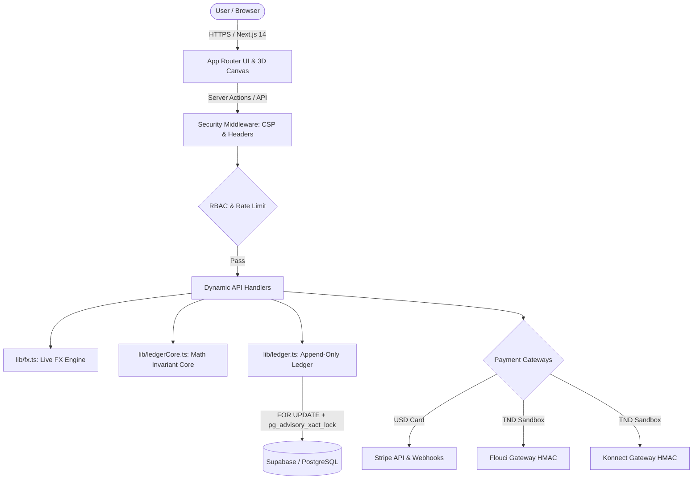

# 🌟 Asteria Freelance: Master Architecture & Security Guide

[](https://nextjs.org/)
[](https://www.typescriptlang.org/)
[](https://supabase.com/)
[](https://stripe.com/)
[](https://jestjs.io/)
[](https://github.com/itshydraaaaaa/Asteria-Freelance/actions)
[](LICENSE)

> **Asteria Freelance** is an enterprise-grade digital marketplace and escrow platform engineered for the **Tunisian and global freelance economy**. It features a mathematical double-entry append-only ledger, PostgreSQL row-level locking, deadlock-free canonical lock ordering, live foreign exchange rate conversion, institutional KYC verification, progressive brute-force defense, high-value Maker-Checker dual control, and automated scheduled financial reconciliation.

---

## 📑 Table of Contents
1. [✨ Key Features](#-key-features)
2. [🏗️ System Architecture](#️-system-architecture)
3. [💰 Financial Ledger, Escrow & Concurrency Core](#-financial-ledger-escrow--concurrency-core)
4. [💱 Foreign Exchange (FX) & Payment Gateways](#-foreign-exchange-fx--payment-gateways)
5. [🔒 Progressive Authentication & Access Control](#-progressive-authentication--access-control)
6. [🪪 KYC Identity Verification & User Safeguards](#-kyc-identity-verification--user-safeguards)
7. [🛡️ Platform Security & Defense-in-Depth](#️-platform-security--defense-in-depth)
8. [📁 Project Structure](#-project-structure)
9. [⚙️ Environment Variables](#️-environment-variables)
10. [🚀 Quick Start & Local Setup](#-quick-start--local-setup)
11. [📡 API Route Reference](#-api-route-reference)
12. [🧪 Automated Testing & CI/CD](#-automated-testing--cicd)

---

## ✨ Key Features

- **🔒 Mathematical Escrow Protection**: Multi-milestone contracts where client funds are locked securely before work begins and released upon deliverable approval.
- **⚡ Zero-Overdraft Concurrency Safety**: PostgreSQL transaction-scoped advisory locks (`pg_advisory_xact_lock`) and `FOR UPDATE` row locks guarantee zero overdrafts under heavy concurrent withdrawal requests.
- **🔄 Deadlock-Free Multi-User Settlements**: Canonical ascending user ID sorting ensures multi-party settlements (`withSortedMultiUserLock`) never deadlock.
- **💱 Live FX & Applied Rate Immutability**: Real-time TND/USD exchange rate service with 1-hour cache TTL and immutable rate storage on historical ledger records.
- **👥 High-Value Maker-Checker Dual Control**: Large payouts ($\ge 1,000\text{ TND}$) require two distinct administrators (Maker Step + Checker Step) to prevent rogue transfers.
- **🛡️ Progressive Anti-Brute-Force Defense**: Replaced weaponizable 15-minute account lockouts with progressive CAPTCHAs and short exponential backoff delays (5s–30s).
- **🪪 Strict Institutional KYC**: Tiered access allowing unrestricted marketplace exploration while requiring approved government ID verification (CIN / Passport) before placing orders or withdrawing payouts.
- **🙈 Private Job Proposals**: Client and Admins view all submitted bids, while freelancers are strictly restricted to seeing only their own proposal.
- **🤖 Native AI Writing Assistant**: Integrated drafting for gigs, job descriptions, and proposals with daily rate caps (20 calls/day), safety moderation filters, and AI disclosure tags.
- **📊 Automated Cron Reconciliation**: Continuous verification of balance equilibrium with automated incident paging on discrepancies or 24-hour withdrawal SLA breaches.

---

## 🏗️ System Architecture



---

## 💰 Financial Ledger, Escrow & Concurrency Core

The platform implements an **append-only, double-entry mathematical ledger**. Direct mutations to `users.wallet_balance` from application code are strictly forbidden. All monetary operations must pass through [`lib/ledger.ts`](file:///c:/Users/MSI/Downloads/Asteria-freelance-main/Asteria-freelance/lib/ledger.ts) and [`lib/ledgerCore.ts`](file:///c:/Users/MSI/Downloads/Asteria-freelance-main/Asteria-freelance/lib/ledgerCore.ts).

### Concurrency Safety (Zero-Overdraft Guarantee)
1. **Transaction-Scoped Advisory Locking**: In PostgreSQL, every balance modification executes `PERFORM pg_advisory_xact_lock(hashtext(p_user_id::text))` combined with `SELECT * FROM users WHERE id = p_user_id FOR UPDATE`.
2. **Canonical Lock Ordering (Deadlock-Free)**: When settling multi-party transactions, user IDs are sorted ascending (`withSortedMultiUserLock`) before locks are acquired:
   $$\text{User}_1 < \text{User}_2 < \text{User}_3$$
3. **20-Parallel Request Test**: Verified in [`__tests__/concurrency_lock.test.ts`](file:///c:/Users/MSI/Downloads/Asteria-freelance-main/Asteria-freelance/__tests__/concurrency_lock.test.ts). Firing 20 parallel withdrawal requests against a balance sufficient for only 1 results in **exactly 1 success, 19 failures, and a 0.00 TND final balance**.

### Escrow Split Formula
When an order or milestone is released:
- **Seller Net Payout (88%)**: $\text{Amount} \times (1 - 0.12) = \text{Amount} \times 0.88$
- **Platform Fee (12%)**: $\text{Amount} \times 0.12$
- **Rounding Invariant**: $\text{sellerPayout} + \text{platformFee} \equiv \text{totalAmount}$

---

## 💱 Foreign Exchange (FX) & Payment Gateways

- **Live FX Service (`lib/fx.ts`)**: Queries live market rates with a **1-hour cache TTL (`CACHE_TTL_MS = 3600 * 1000`)** and audit-logged admin overrides.
- **Applied Rate Immutability**: The exact exchange rate applied at checkout (`exchangeRateApplied`) is permanently stored on the `wallet_transactions` row, preventing historical recomputation drift.
- **Constant-Time HMAC Verification**: Flouci and Konnect webhooks use `crypto.timingSafeEqual(sigBuf, expBuf)` to eliminate timing side-channels.
- **Anti-Replay Timestamp Tolerance**: Webhook payloads older than 5 minutes ($\pm 300\text{s}$) are rejected with `400 Bad Request`.

---

## 🔒 Progressive Authentication & Access Control

- **Progressive Anti-Brute-Force Defense**:
  - **Attempts 1–2**: Normal feedback (`requireCaptcha: false`).
  - **Attempts 3–4**: CAPTCHA challenge required (`requireCaptcha: true`).
  - **Attempts 5+**: Exponential backoff delay enforced (5s to 30s max).
  - **Zero DoS Lockouts**: A legitimate user providing the correct password/solving CAPTCHA has their failure counter immediately cleared via `resetFailedLogins()`.
- **Role-Based Access Control (RBAC)**: Strict separation of `CLIENT`, `FREELANCER`, and `ADMIN` privileges enforced via [`lib/authz.ts`](file:///c:/Users/MSI/Downloads/Asteria-freelance-main/Asteria-freelance/lib/authz.ts).

---

## 🪪 KYC Identity Verification & User Safeguards

- **Unverified Order Guard**: Unverified users (`UNSUBMITTED`, `PENDING`, `REJECTED`) are prevented from placing orders or creating escrow agreements until their KYC profile is approved by Admin.
- **Exploration Allowed**: Unverified users can freely browse gigs, explore freelancer portfolios, and read platform documentation.
- **Withdrawal Guard**: Only `APPROVED` freelancer accounts can initiate withdrawal requests (`/api/wallet/withdraw`).

---

## 🛡️ Platform Security & Defense-in-Depth

- **Content-Security-Policy (CSP)**: Strict domain allowlists configured in [`next.config.mjs`](file:///c:/Users/MSI/Downloads/Asteria-freelance-main/Asteria-freelance/next.config.mjs) covering Stripe, Supabase, and payment gateways.
- **`server-only` Package Protection**: Backend database, secret keys, and ledger modules are protected with `import 'server-only'`.
- **Shared-Store Rate Limiter**: Shared sliding window rate limits backed by PostgreSQL `rate_limit_log` across all abuse targets (Auth, KYC, AI, Withdrawals, Proposals).
- **Immutable Audit Logging**: Every critical financial, administrative, and security action is logged to `db.auditLog`.

---

## 📁 Project Structure

```
Asteria-freelance/
├── .github/workflows/ci.yml       # GitHub Actions automated CI pipeline
├── app/
│   ├── (auth)/                    # Login, Register, Password Reset
│   ├── actions/                   # Server Actions (Auth, Gigs, Jobs, Orders)
│   ├── api/                       # Dynamic API route handlers
│   │   ├── admin/                 # Admin management & reconciliation
│   │   ├── ai/                    # AI writing assistant
│   │   ├── cron/reconciliation/   # Scheduled ledger reconciliation & SLA
│   │   ├── payments/              # Flouci & Konnect sandbox gateways
│   │   ├── stripe/                # Stripe checkout & webhooks
│   │   └── wallet/withdraw/       # Idempotent payout requests
│   └── dashboard/                 # Client, Freelancer & Admin Dashboards
├── components/
│   ├── 3d/                        # Three.js 3D Canvas (Lazy-loaded)
│   ├── layout/                    # Navbar, Footer
│   ├── orders/                    # Workspace & Milestone Tracker
│   └── ui/                        # Radix UI, Buttons, Modals, Escrow Badges
├── lib/
│   ├── auth.ts                    # Session & Supabase auth helper
│   ├── authz.ts                   # Role-Based Access Control guards
│   ├── db.ts                      # Unified Data Access Layer
│   ├── email.ts                   # Transactional Email Notification Service
│   ├── fx.ts                      # Live FX Rate Service & Admin Override
│   ├── ledger.ts                  # Append-Only Ledger, Locks & Idempotency
│   ├── ledgerCore.ts              # Pure Mathematical Ledger Core
│   ├── logger.ts                  # Security, Audit & Error Logger
│   └── rateLimit.ts               # Shared-Store Rate Limiter & Progressive Auth
├── supabase/
│   └── migrations/                # PostgreSQL SQL Schema & Stored Procedures
└── __tests__/                     # 16 Automated Test Suites (104 Tests)
```

---

## ⚙️ Environment Variables

Create a `.env.local` file in the root directory:

```env
# Application URL
NEXT_PUBLIC_APP_URL="http://localhost:5000"

# Supabase Database & Auth
NEXT_PUBLIC_SUPABASE_URL="https://your-project.supabase.co"
NEXT_PUBLIC_SUPABASE_ANON_KEY="your-anon-key"
SUPABASE_SERVICE_ROLE_KEY="your-service-role-key"

# Financial Configuration
CURRENCY="TND"
TND_TO_USD_RATE="0.32"
HIGH_VALUE_WITHDRAWAL_THRESHOLD="1000"
WITHDRAWAL_SLA_HOURS="24"
CRON_SECRET="your-secure-cron-secret"

# Stripe Gateway
STRIPE_SECRET_KEY="sk_test_..."
STRIPE_WEBHOOK_SECRET="whsec_..."

# Flouci Sandbox Gateway
FLOUCI_APP_TOKEN="your-flouci-app-token"
FLOUCI_APP_SECRET="asteria_flouci_sandbox_secret"

# Konnect Sandbox Gateway
KONNECT_API_KEY="your-konnect-api-key"
KONNECT_WALLET_ID="your-wallet-id"
KONNECT_WEBHOOK_KEY="asteria_konnect_sandbox_key"

# Transactional Emails (Resend)
RESEND_API_KEY="re_..."
```

---

## 🚀 Quick Start & Local Setup

```bash
# 1. Clone the repository
git clone https://github.com/itshydraaaaaa/Asteria-Freelance.git
cd Asteria-Freelance

# 2. Install dependencies
npm install

# 3. Run type check and test suites
npm test

# 4. Start local development server
npm run dev
```

Visit `http://localhost:5000` to interact with the platform.

---

## 🧪 Automated Testing & CI/CD

Asteria features **16 Jest test suites containing 104 passing unit and integration tests**:

```bash
# Execute all automated tests
npm test

# Run strict TypeScript validation
npx tsc --noEmit

# Run Next.js production build
npm run build
```

Every push and pull request to `main` is validated automatically via [`.github/workflows/ci.yml`](file:///.github/workflows/ci.yml).

---

## 📄 License
This project is licensed under the MIT License — see the [LICENSE](LICENSE) file for details.
